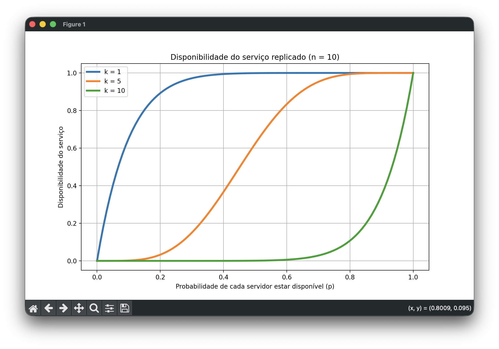
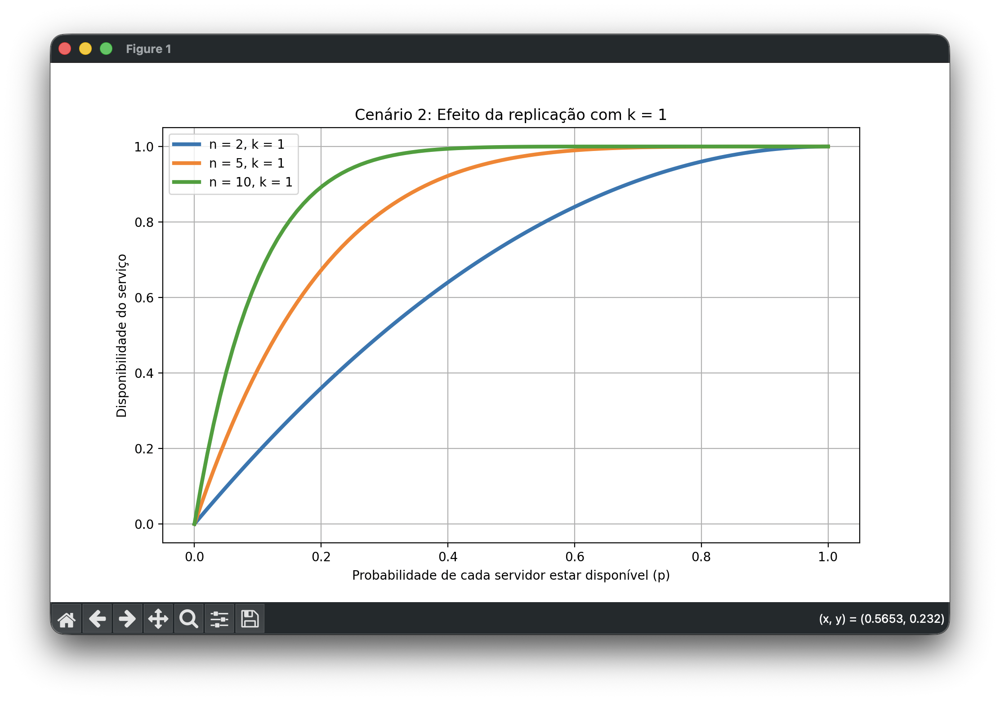
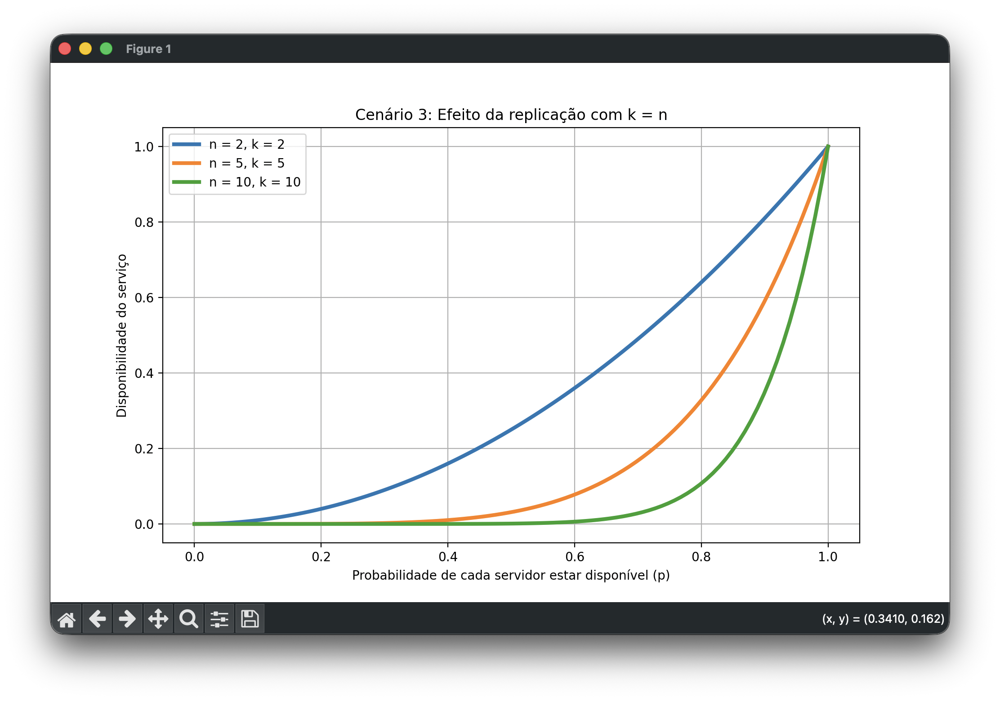
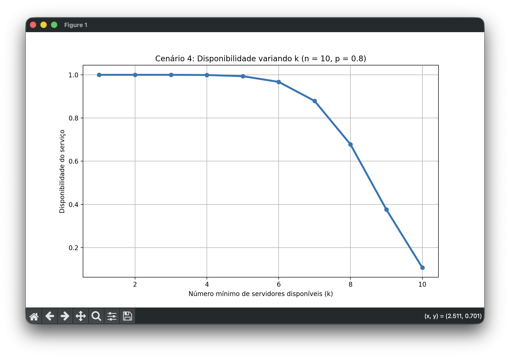

# Disponibilidade de Serviço Replicado

## Descrição
Este trabalho da disciplina de **Computação Distribuída** tem como objetivo calcular e analisar a **disponibilidade de um serviço replicado em múltiplos servidores**.

A aplicação utiliza uma fórmula matemática para calcular a probabilidade de o serviço estar disponível, considerando:

- **n**: número total de servidores  
- **k**: número mínimo de servidores disponíveis para o serviço funcionar  
- **p**: probabilidade de cada servidor estar disponível  

Além do cálculo da disponibilidade, o projeto também permite visualizar diferentes **cenários de análise**, variando os valores de **n**, **k** e **p**, com o objetivo de comparar o comportamento do sistema em situações como:

- baixa e alta exigência de quorum
- aumento da quantidade de réplicas
- comparação entre casos extremos, como **\(k = 1\)** e **\(k = n\)**

Os resultados são exibidos por meio de **gráficos 2D**, facilitando a interpretação do impacto de cada parâmetro na disponibilidade final do serviço.

---

## Explicação da Fórmula

A fórmula abaixo é usada para calcular a disponibilidade de um serviço replicado em vários servidores:

$$
A(n,k,p)=\sum_{i=k}^{n}\binom{n}{i}p^i(1-p)^{n-i}
$$

A ideia dela é descobrir a probabilidade de o serviço estar disponível, considerando que ele só funciona corretamente se **pelo menos \(k\) servidores** estiverem ativos entre os **\(n\) servidores** existentes.

### O que cada parte significa

- $n$: número total de servidores
- $k$: número mínimo de servidores que precisam estar disponíveis
- $p$: probabilidade de cada servidor estar disponível
- $\binom{n}{i}$: quantidade de maneiras de escolher $i$ servidores disponíveis entre $n$
- $p^i$: probabilidade de esses $i$ servidores estarem disponíveis
- $(1-p)^{n-i}$: probabilidade de os outros $n-i$ servidores estarem indisponíveis

### Como a fórmula funciona

Primeiro, a fórmula calcula a probabilidade de existirem **exatamente \(i\) servidores disponíveis**.  
Depois, como o serviço funciona quando há **pelo menos \(k\)** servidores ativos, ela soma todos os casos possíveis de \(i=k\) até \(i=n\).

Ou seja, ela considera:

- a chance de haver exatamente \(k\) servidores disponíveis
- mais a chance de haver exatamente \(k+1\)
- e assim por diante
- até o caso em que todos os \(n\) servidores estão disponíveis

### Resumindo

Em resumo, essa fórmula soma todas as situações em que o serviço ainda consegue funcionar.  
Por isso, ela representa a **disponibilidade total do sistema replicado**.

---

## Casos Extremos

- **Se \(k=1\)**:  
$$
A(n,1,p)=1-(1-p)^n
$$

- **Se \(k=n\)**:  
$$
A(n,n,p)=p^n
$$

---

## Resposta Comentada
A fórmula foi deduzida a partir da probabilidade de existirem **exatamente \(i\) servidores disponíveis** entre \(n\).  

- $\binom{n}{i}$: quantidade de combinações possíveis  
- $p^i$: probabilidade de $i$ servidores estarem disponíveis  
- $(1-p)^{n-i}$: probabilidade dos demais estarem indisponíveis    

Como o serviço funciona com **pelo menos \(k\)** servidores disponíveis, somamos os casos de \(i=k\) até \(i=n\).

---

## Instalação das dependências e Execução

```bash
python3 -m venv venv
source venv/bin/activate
pip install -r requirements.txt
python analise.py (Windows)
python3 analise.py (MacOS)
```

## Classes em Python

### `DisponibilidadeServico`
Classe responsável por:

- receber os valores de **n**, **k** e **p**
- validar os parâmetros informados
- calcular a disponibilidade do serviço com base na fórmula matemática

### `AnaliseDisponibilidade`
Classe responsável por:

- calcular curvas de disponibilidade para diferentes combinações de **n**, **k** e **p**
- exibir os cenários de análise definidos no projeto
- comparar a mudança da disponibilidade em função de p, em diferentes cenários
- plotar gráficos 2D com **Matplotlib**
- apresentar um menu interativo para seleção dos cenários

---

## Cenários de Análise

Para entender melhor o comportamento da fórmula, a aplicação foi organizada em **quatro cenários de análise**. Cada cenário foi pensado para mostrar como a disponibilidade do serviço muda quando variamos os parâmetros **n**, **k** e **p**.

### Cenário 1 — Comparação entre `k = 1`, `k = n/2` e `k = n` com `n` fixo

Neste cenário, foi fixado o valor de **n = 10** e comparados três casos:

- **k = 1**
- **k = n/2**
- **k = n**

A variável **p** foi alterada de 0 até 1.

#### Por que esse cenário é interessante
Esse cenário é importante porque mostra diretamente o impacto do **quorum mínimo** na disponibilidade do serviço. Ele permite comparar um caso mais flexível, um intermediário e um mais restritivo.

#### Resultado observado
Foi possível observar que:

- quando **k = 1**, a disponibilidade do serviço cresce rapidamente, mesmo para valores menores de **p**
- quando **k = n/2**, o comportamento é intermediário
- quando **k = n**, a disponibilidade só se torna alta quando **p** está muito próximo de 1

Isso mostra que, quanto maior o número mínimo de servidores exigidos, menor tende a ser a disponibilidade do serviço.



---

### Cenário 2 — Comparação entre diferentes valores de `n` com `k = 1`

Neste cenário, foi fixado **k = 1** e comparado o comportamento do sistema para diferentes quantidades de servidores:

- **n = 2**
- **n = 5**
- **n = 10**

A variável **p** também foi alterada de 0 até 1.

#### Por que esse cenário é interessante
Esse cenário mostra o efeito da **replicação** em um caso mais flexível, no qual basta um servidor disponível para o serviço funcionar.

#### Resultado observado
Foi observado que, à medida que o número de servidores aumenta, a disponibilidade do serviço também aumenta. Isso acontece porque, com mais réplicas, cresce a chance de pelo menos um servidor estar disponível.

Esse cenário mostra que a replicação melhora bastante a disponibilidade quando o quorum exigido é baixo.



---

### Cenário 3 — Comparação entre diferentes valores de `n` com `k = n`

Neste cenário, foi analisado o caso oposto ao anterior. Foram comparados diferentes valores de **n**, mas agora com:

- **k = n**

Ou seja, todos os servidores precisam estar disponíveis para que o serviço funcione.

#### Por que esse cenário é interessante
Esse cenário é importante porque mostra que a replicação nem sempre aumenta a disponibilidade. Tudo depende da regra de acesso adotada pelo sistema.

#### Resultado observado
Foi observado que, quando todos os servidores precisam estar disponíveis ao mesmo tempo, aumentar o número de servidores faz a disponibilidade diminuir. Isso acontece porque a condição para o serviço funcionar se torna mais difícil de ser satisfeita.

Esse resultado mostra que, em operações mais restritivas, mais réplicas podem aumentar a exigência do sistema em vez de melhorar sua disponibilidade.



---

### Cenário 4 — Variação de `k` com `n` e `p` fixos

Neste cenário, foram fixados:

- **n = 10**
- **p = 0.8**

e o valor de **k** foi variado de **1 até 10**.

#### Por que esse cenário é interessante
Esse cenário permite observar de forma direta o efeito do aumento do quorum mínimo na disponibilidade do serviço, mantendo os demais parâmetros constantes.

#### Resultado observado
Foi observado que a disponibilidade do serviço diminui progressivamente à medida que **k** aumenta. Quando o sistema exige poucos servidores disponíveis, a disponibilidade é alta. Já quando exige muitos servidores simultaneamente, a disponibilidade cai.

Esse cenário reforça a ideia de que o parâmetro **k** tem impacto direto no comportamento do sistema.



---

## Conclusão dos Cenários

A análise dos cenários mostrou que a disponibilidade do serviço replicado depende fortemente da relação entre **n**, **k** e **p**.

De forma geral, foi possível concluir que:

- aumentar **p** melhora a disponibilidade em todos os casos
- aumentar **k** torna o sistema mais restritivo e reduz a disponibilidade
- aumentar **n** pode melhorar ou piorar a disponibilidade, dependendo do valor de **k**
- a replicação é mais vantajosa quando o serviço não exige que todos os servidores estejam disponíveis ao mesmo tempo

## Integrantes
- Victor Sucupira - 1410777
- Lucas Fontenele - 1810490
- Diego Antonioli - 2214654

---